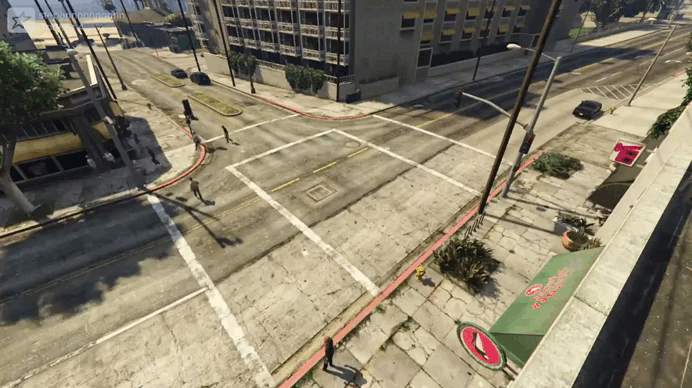

# 🚦 Red-Light Traffic Violation Detector

This project is an intelligent traffic violation detection system that automatically identifies whether a vehicle has run a red light using video footage.

### Dataset

The YOLO deep learning model was trained on a dataset generated from the GTA-5 game. The video used to demonstrate the traffic violation ("running a red light") was also captured from the game.

The system uses computer vision to:
- Detect the current traffic light signal
- Determine if a car has crossed the stop line during a red light

And deep learning:
- Detect cars in the video frame using a custom-trained YOLOv8 model

## Demo Preview



## Tech Stack

- Python 3.10+
- OpenCV
- NumPy
- PyTorch
- Ultralytics YOLOv8

---

## Installation

```bash
git clone https://github.com/TimSkripnikov/Red-Light-Traffic-Detector
cd Red-Light-Traffic-Detector
pip install -r requirements.txt
```
---

```bash
python3 main.py
```
This command will:
- Open a video file
- Detect current traffic light signal using a mask
- Detect cars in the frame
- Print "Violation" on the screen if a car crosses the stop line during a red light
- You can press q to quit the video processing window

--- 

## Project Structure 
```text
.
├── detector/                  # Core detection logic
│   ├── detect_cars.py         # Car detection using YOLOv8
│   ├── detect_lights.py       # Traffic light color detection
│   └── violation_checker.py   # Violation detection logic
│
├── data/
│   ├── videos/                # Input video files
│   └── masks/                 # Binary masks for traffic light and stop line
│
├── utils/
│   └── save_frame.py          # Script for saving one frame to create binary mask (e.g. in GIMP)
│
├── model/
│   └── yolov8n_car.pt         # YOLOv8 weights trained to detect cars
│
├── main.py                    # Entry point for the application
├── requirements.txt           # Python dependencies
└── README.md                  # Project documentation
```
